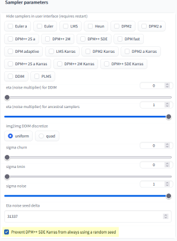

# Stable Diffusion extension: Prevent DPM++ SDE Karras from always using a random seed

A custom extension for [AUTOMATIC1111/stable-diffusion-webui](https://github.com/AUTOMATIC1111/stable-diffusion-webui) to prevent DPM++ SDE Karras from always using a random seed.

The DPM++ SDE Karras sampler currently works like this:

1. Batch size = 1: Repeating the generation gives almost the identical image
2. Batch size = 2: Repeating the generation gives almost the identical images (however, the first image is different than if only one image is generated)
3. Batch size = 3: Repeating the generation gives almost the identical images (however, the first two images are different than if only one or two images are generated)
and so on...

That means if you are, for example, running with a batch size of 50 and you like picture #3 and want to retry it with a slightly different prompt, you would have to run all 50 images again.

This extension aims to solve this issue, as much as possible. If you enable it in the settings:

your result will be like this:

1. Batch size = 1: Repeating the generation gives almost the identical image
2. Batch size = 2: Repeating the generation gives almost the identical images (and the first image is also almost identical than if only one image is generated)
3. Batch size = 3: Repeating the generation gives almost the identical images (and the first two images are also almost identical than if only one or two images are generated)
and so on...

So, for the same example as above, a batch size of 50 and you like picture #3 and want to retry it with a slightly different prompt, you now only have to rerun 3 images.

Please note: This changes the seed logic for DPM++ SDE Karras, so the same seed in older images will give different results now. But you can always disable the new logic in the settings.

## Installation

The extension can be installed directly from within the **Extensions** tab within the Webui.

You can also install it manually by running the following command from within the webui directory:

	git clone https://github.com/AlUlkesh/sd_dpmpp_sde_no_random/ extensions/sd_dpmpp_sde_no_random
